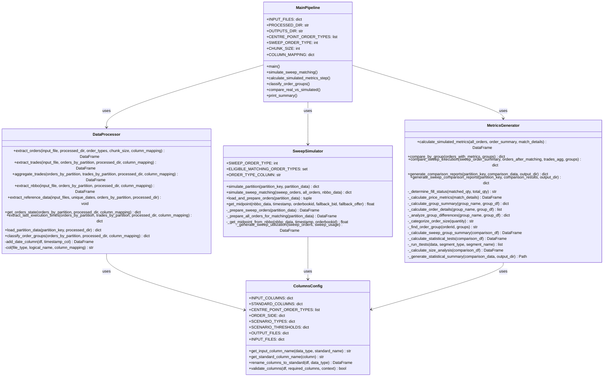
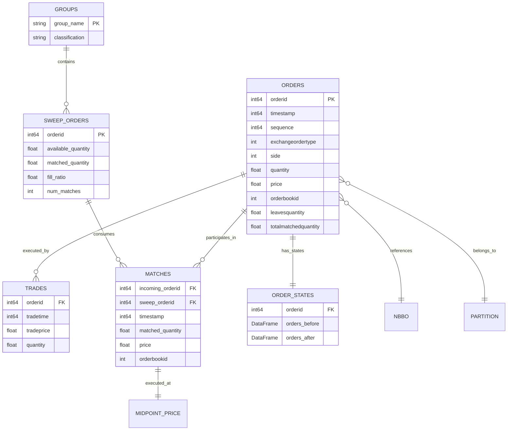

# Centre Point Sweep Order Matching Pipeline
## Technical Specification & Architecture Document

---

## Project Structure

```
sweeporders/
├── src/                          # Source code
│   ├── main.py                   # Main pipeline controller
│   ├── data_processor.py         # Data extraction and preparation
│   ├── sweep_simulator.py        # Sweep matching simulation
│   ├── metrics_generator.py      # Metrics calculation and comparison
│   └── columns.py                # Configuration and column mappings
├── data/                         # Data directory
│   ├── raw/                      # Raw input data
│   ├── processed/                # Intermediate processed data
│   └── outputs/                  # Final simulation results
├── docs/                         # Documentation
│   ├── TECHNICAL_SPECIFICATION.md
│   ├── bi.txt
│   └── dd.txt
├── requirements.txt              # Python dependencies
└── README.md
```

---

## Table of Contents

1. [System Overview](#system-overview)
2. [Architecture](#architecture)
3. [Class Diagrams](#class-diagrams)
4. [Module Specifications](#module-specifications)
5. [Data Flow](#data-flow)
6. [Algorithms](#algorithms)
7. [Data Models](#data-models)
8. [Configuration](#configuration)

---

## 1. System Overview

### Purpose
The Centre Point Sweep Order Matching Pipeline is a Python-based system designed to analyze and simulate sweep order matching behavior in Centre Point order books. It extracts historical order and trade data, simulates sweep order matching using a time-priority algorithm, and compares simulated execution against real market execution.

### Key Objectives
- Extract and process Centre Point orders and trades from raw market data
- Simulate sweep order matching with time-priority algorithm
- Compare simulated vs real execution metrics
- Generate comprehensive statistical reports
- Classify orders into execution groups (Fully Filled, Partially Filled, Unfilled)

### Technology Stack
- **Language**: Python 3.x
- **Key Libraries**: pandas, numpy, scipy
- **Data Storage**: CSV/Compressed CSV (gzip)
- **Architecture Pattern**: Pipeline/ETL

---

## 2. Architecture

### High-Level Architecture

```
┌─────────────────────────────────────────────────────────────────┐
│                         MAIN PIPELINE                           │
│                          (main.py)                              │
└───────────────────┬─────────────────────────────────────────────┘
                    │
        ┌───────────┼───────────┐
        │           │           │
        ▼           ▼           ▼
┌──────────────┐ ┌──────────────┐ ┌──────────────────┐
│     DATA     │ │    SWEEP     │ │     METRICS      │
│  PROCESSOR   │ │  SIMULATOR   │ │    GENERATOR     │
│             │ │              │ │                  │
│ - Extract    │ │ - Load Orders│ │ - Calculate      │
│ - Partition  │ │ - Simulate   │ │ - Compare        │
│ - Aggregate  │ │ - Match      │ │ - Report         │
└──────────────┘ └──────────────┘ └──────────────────┘
        │                │                  │
        └────────────────┴──────────────────┘
                         │
                         ▼
              ┌──────────────────────┐
              │   DATA STORAGE       │
              │                      │
              │ - data/processed/    │
              │ - data/outputs/      │
              └──────────────────────┘
```

### Pipeline Stages

```
STAGE 1-7: DATA EXTRACTION & PREPARATION
┌────────────────────────────────────────────────────────┐
│ 1. Extract Orders         → cp_orders_filtered.csv.gz │
│ 2. Extract Trades         → cp_trades_matched.csv.gz  │
│ 3. Aggregate Trades       → cp_trades_aggregated.csv  │
│ 4. Extract NBBO           → nbbo.csv.gz               │
│ 5. Extract Reference Data → session/reference/par     │
│ 6. Get Orders State       → orders_before/after.csv   │
│ 7. Extract Exec Times     → last_execution_time.csv   │
└────────────────────────────────────────────────────────┘
                         │
                         ▼
STAGE 8: SIMULATION
┌────────────────────────────────────────────────────────┐
│ 8. Simulate Sweep Matching                             │
│    → simulation_order_summary.csv                      │
│    → simulation_match_details.csv                      │
└────────────────────────────────────────────────────────┘
                         │
                         ▼
STAGE 9-11: ANALYSIS & REPORTING
┌────────────────────────────────────────────────────────┐
│ 9.  Calculate Simulated Metrics                        │
│ 10. Classify Order Groups                              │
│ 11. Compare Real vs Simulated                          │
│     → sweep_order_comparison.csv                       │
│     → sweep_group_summary.csv                          │
│     → sweep_statistical_tests.csv                      │
│     → sweep_size_analysis.csv                          │
└────────────────────────────────────────────────────────┘
```

---

## 3. Class Diagrams

### Module Structure



### Data Entity Relationships



---

## 4. Module Specifications

### 4.1 src/main.py - Main Pipeline Controller

**Responsibility**: Orchestrates the entire ETL and simulation pipeline
**Location**: `src/main.py`

**Key Functions**:

#### `main()`
```python
def main() -> None
```
- **Purpose**: Entry point for the pipeline
- **Process**:
  1. Initialize directories and configuration
  2. Execute 11 pipeline stages sequentially
  3. Print execution summary
- **Output**: Processed data in `data/processed/` and results in `data/outputs/`

#### `simulate_sweep_matching()`
```python
def simulate_sweep_matching(
    orders_by_partition: dict,
    nbbo_by_partition: dict,
    output_dir: str
) -> dict
```
- **Purpose**: Coordinate simulation across all partitions
- **Input**:
  - `orders_by_partition`: Dict mapping partition_key → DataFrame
  - `nbbo_by_partition`: Dict mapping partition_key → NBBO DataFrame
  - `output_dir`: Output directory path
- **Output**: Dict mapping partition_key → simulation results
- **Side Effects**: Writes CSV files to output directory

#### `calculate_simulated_metrics_step()`
```python
def calculate_simulated_metrics_step(
    orders_by_partition: dict,
    simulation_results_by_partition: dict,
    output_dir: str
) -> dict
```
- **Purpose**: Calculate simulation metrics for all orders
- **Output**: Dict mapping partition_key → orders with metrics

#### `classify_order_groups()`
```python
def classify_order_groups(
    orders_by_partition: dict
) -> dict
```
- **Purpose**: Classify sweep orders into 3 groups based on real execution
- **Groups**:
  - Group 1: Fully Filled (leavesquantity == 0)
  - Group 2: Partially Filled (leavesquantity > 0 AND totalmatchedquantity > 0)
  - Group 3: Unfilled (leavesquantity > 0 AND totalmatchedquantity == 0)
- **Output**: Dict mapping partition_key → groups dict

#### `compare_real_vs_simulated()`
```python
def compare_real_vs_simulated(
    simulation_results_by_partition: dict,
    groups_by_partition: dict,
    orders_by_partition: dict,
    output_dir: str
) -> None
```
- **Purpose**: Generate comprehensive comparison reports
- **Output**: Multiple CSV reports per partition

---

### 4.2 src/data_processor.py - Data Extraction & Preparation

**Responsibility**: Extract, partition, and prepare all raw data for simulation
**Location**: `src/data_processor.py`

**Key Functions**:

#### `extract_orders()`
```python
def extract_orders(
    input_file: str,
    processed_dir: str,
    order_types: list,
    chunk_size: int,
    column_mapping: dict
) -> dict
```
- **Purpose**: Extract Centre Point orders and partition by date/security
- **Algorithm**:
  1. Read orders CSV in chunks
  2. Filter by order_types (Centre Point types)
  3. Convert timestamp to AEST date
  4. Partition by (date, security_code)
  5. Save each partition to compressed CSV
- **Output**: Dict mapping "YYYY-MM-DD/securitycode" → DataFrame
- **Performance**: Processes in 100K row chunks to handle large files

#### `extract_trades()`
```python
def extract_trades(
    input_file: str,
    orders_by_partition: dict,
    processed_dir: str,
    column_mapping: dict
) -> dict
```
- **Purpose**: Extract trades matching order IDs from partitions
- **Algorithm**:
  1. Collect all order IDs from all partitions
  2. Read trades CSV in chunks
  3. Filter for matching order IDs
  4. Partition trades to match order partitions
  5. Save per partition
- **Output**: Dict mapping partition_key → trades DataFrame

#### `aggregate_trades()`
```python
def aggregate_trades(
    orders_by_partition: dict,
    trades_by_partition: dict,
    processed_dir: str,
    column_mapping: dict
) -> dict
```
- **Purpose**: Aggregate trade metrics per order
- **Aggregations**:
  - `total_quantity_filled`: Sum of trade quantities
  - `avg_execution_price`: Quantity-weighted average price
  - `first_trade_time`: Min trade time
  - `last_trade_time`: Max trade time
  - `num_trades`: Count of trades
  - `execution_duration_sec`: Time between first and last trade
- **Output**: Dict mapping partition_key → aggregated DataFrame

#### `get_orders_state()`
```python
def get_orders_state(
    orders_by_partition: dict,
    processed_dir: str,
    column_mapping: dict
) -> dict
```
- **Purpose**: Extract before/after order states
- **Algorithm**:
  1. Sort orders by (timestamp, sequence)
  2. Group by order_id
  3. Take first() for "before" state (initial submission)
  4. Take last() for "after" state (final state)
- **Output**: Dict with 'before' and 'after' DataFrames per partition
- **Critical**: Uses first occurrence per order for correct placement time

#### `load_partition_data()`
```python
def load_partition_data(
    partition_key: str,
    processed_dir: str
) -> dict
```
- **Purpose**: Load all necessary files for simulation
- **Loads**:
  - `orders_before_matching.csv`
  - `orders_after_matching.csv`
  - `last_execution_time.csv`
- **Output**: Dict with loaded DataFrames

#### `classify_order_groups()`
```python
def classify_order_groups(
    orders_by_partition: dict,
    processed_dir: str,
    column_mapping: dict
) -> dict
```
- **Purpose**: Classify SWEEP orders (type 2048 only) by execution outcome
- **Classification Logic**:
  ```python
  if leavesquantity == 0:
      group = "Group 1 (Fully Filled)"
  elif leavesquantity > 0 and totalmatchedquantity > 0:
      group = "Group 2 (Partially Filled)"
  elif leavesquantity > 0 and totalmatchedquantity == 0:
      group = "Group 3 (Unfilled)"
  ```
- **Output**: Dict mapping partition_key → groups dict

---

### 4.3 src/sweep_simulator.py - Sweep Matching Simulation

**Responsibility**: Simulate sweep order matching with time-priority algorithm
**Location**: `src/sweep_simulator.py`

**Key Functions**:

#### `simulate_partition()`
```python
def simulate_partition(
    partition_key: str,
    partition_data: dict
) -> dict
```
- **Purpose**: Simulate sweep matching for one partition
- **Process**:
  1. Load and prepare sweep orders and all orders
  2. Load NBBO data
  3. Run simulation
  4. Return results
- **Output**: Dict with 'match_details', 'order_summary', 'sweep_utilization'

#### `simulate_sweep_matching()`
```python
def simulate_sweep_matching(
    sweep_orders: DataFrame,
    all_orders: DataFrame,
    nbbo_data: DataFrame
) -> dict
```
- **Purpose**: Core simulation algorithm
- **Algorithm** (Sweep-Centric Time Priority):
  ```
  FOR each sweep_order in chronological order (by placement timestamp):
      1. Get execution time window [first_exec_time, last_exec_time]
      2. Find all orders that arrived in time window
      3. Filter for:
         - Opposite side
         - Same orderbookid
         - NOT the sweep itself (critical)
      4. Sort eligible orders by (timestamp, sequence)
      5. Match sequentially until:
         - Sweep is filled, OR
         - No more eligible orders
      6. Record each match at midpoint price
      7. Update remaining quantities
  END FOR
  ```
- **Critical Rules**:
  - Sweep orders processed by **placement time** (not execution time)
  - Exclude sweep itself from matching pool
  - Strict time priority: timestamp → sequence
  - All matches at midpoint price
  - Update quantities after each match
- **Output**: Dict with match_details, order_summary, sweep_utilization DataFrames

#### `load_and_prepare_orders()`
```python
def load_and_prepare_orders(
    partition_data: dict
) -> tuple[DataFrame, DataFrame]
```
- **Purpose**: Prepare orders for simulation
- **Returns**: (sweep_orders, all_orders)
- **Processing**:
  - Extract sweep orders (type 2048)
  - Use first occurrence for placement time
  - Merge with final state for leavesquantity
  - Prepare all Centre Point orders as matching pool

#### `get_midpoint()`
```python
def get_midpoint(
    nbbo_data: DataFrame,
    timestamp: int,
    orderbookid: int,
    fallback_bid: float,
    fallback_offer: float
) -> float
```
- **Purpose**: Calculate midpoint price for matching
- **Priority**:
  1. NBBO data (most recent quote before timestamp)
  2. Fallback to order's bid/offer
- **Formula**: `midpoint = (bid + offer) / 2.0`

---

### 4.4 src/metrics_generator.py - Metrics Calculation & Comparison

**Responsibility**: Calculate simulation metrics and compare with real execution
**Location**: `src/metrics_generator.py`

**Key Functions**:

#### `calculate_simulated_metrics()`
```python
def calculate_simulated_metrics(
    all_orders: DataFrame,
    order_summary: DataFrame,
    match_details: DataFrame
) -> DataFrame
```
- **Purpose**: Calculate simulated execution metrics per order
- **Calculated Metrics**:
  - `simulated_matched_quantity`: Total quantity matched
  - `simulated_fill_ratio`: matched_quantity / total_quantity
  - `simulated_fill_status`: 'Fully Filled' / 'Partially Filled' / 'Unfilled'
  - `simulated_num_matches`: Count of matches
  - `simulated_avg_price`: Quantity-weighted average price
  - `simulated_total_value`: Total value of matches
- **Output**: Enhanced DataFrame with simulated_ prefixed columns

#### `compare_sweep_execution()`
```python
def compare_sweep_execution(
    sweep_order_summary: DataFrame,
    orders_after_matching: DataFrame,
    trades_agg: DataFrame,
    groups: dict
) -> dict
```
- **Purpose**: Comprehensive comparison of sweep order execution
- **Comparisons**:
  - Matched quantity (real vs simulated)
  - Fill ratio (real vs simulated)
  - Number of matches
  - Price differences
  - Group membership
  - Size category
- **Outputs**:
  - `sweep_comparison`: Per-order comparison
  - `group_summary`: Statistics by group
  - `statistical_tests`: Paired t-tests
  - `size_analysis`: Analysis by order size

#### `_calculate_statistical_tests()`
```python
def _calculate_statistical_tests(
    comparison_df: DataFrame
) -> DataFrame
```
- **Purpose**: Run paired t-tests on execution metrics
- **Tests**:
  - Matched Quantity: simulated vs real
  - Fill Ratio: simulated vs real
  - Number of Matches: simulated vs real
- **Segments**:
  - Overall
  - By group (Group 1, 2, 3)
  - By size (Small, Medium, Large)
  - By group × size combinations
- **Statistics**:
  - t-statistic
  - p-value
  - Mean difference
  - 95% confidence interval
  - Significance flags (5%, 1%)

#### `generate_sweep_comparison_reports()`
```python
def generate_sweep_comparison_reports(
    partition_key: str,
    comparison_results: dict,
    output_dir: Path
) -> dict
```
- **Purpose**: Generate all comparison report files
- **Reports Generated**:
  1. `sweep_order_comparison.csv`: Per-order comparison
  2. `sweep_group_summary.csv`: Group-level statistics
  3. `sweep_statistical_tests.csv`: T-test results
  4. `sweep_size_analysis.csv`: Size category analysis
- **Output**: Dict mapping report_type → file_path

---

## 5. Data Flow

### 5.1 Data Partitioning Strategy

```
Raw Data (All dates, all securities)
            |
            ↓
  Partition by (date, security_code)
            |
            ↓
  ┌────────────────────────────┐
  │ Partition: 2024-09-05/110621
  ├────────────────────────────┤
  │ - cp_orders_filtered.csv.gz
  │ - cp_trades_matched.csv.gz
  │ - cp_trades_aggregated.csv.gz
  │ - nbbo.csv.gz
  │ - orders_before_matching.csv
  │ - orders_after_matching.csv
  │ - last_execution_time.csv
  └────────────────────────────┘
```

### 5.2 Simulation Data Flow

```
INPUT DATA
┌──────────────────────────────────────┐
│ orders_before_matching.csv           │  ← Initial order states
│ orders_after_matching.csv            │  ← Final order states
│ last_execution_time.csv              │  ← Execution windows
│ nbbo.csv.gz                          │  ← Price reference
└──────────────────────────────────────┘
                |
                ↓
        LOAD & PREPARE
┌──────────────────────────────────────┐
│ Sweep Orders (type 2048)             │
│ - Placement time (from first state)  │
│ - Available quantity (from final)    │
│ - Execution window                   │
│                                      │
│ All Orders (CP types)                │
│ - Chronologically sorted             │
│ - Opposite side matching             │
└──────────────────────────────────────┘
                |
                ↓
       SIMULATE MATCHING
┌──────────────────────────────────────┐
│ For each sweep (by placement time):  │
│   1. Get execution window            │
│   2. Find eligible orders            │
│   3. Match by time priority          │
│   4. Calculate midpoint price        │
│   5. Update quantities               │
└──────────────────────────────────────┘
                |
                ↓
         OUTPUT RESULTS
┌──────────────────────────────────────┐
│ simulation_order_summary.csv         │  ← Per sweep summary
│ simulation_match_details.csv         │  ← All individual matches
└──────────────────────────────────────┘
```

### 5.3 Comparison Data Flow

```
REAL EXECUTION               SIMULATED EXECUTION
┌──────────────────┐        ┌──────────────────┐
│ orders_after_    │        │ simulation_order_│
│   matching       │        │   summary        │
├──────────────────┤        ├──────────────────┤
│ - matched qty    │        │ - matched qty    │
│ - leaves qty     │        │ - fill ratio     │
│ - total matched  │        │ - num matches    │
└──────────────────┘        └──────────────────┘
        |                            |
        └──────────┬─────────────────┘
                   ↓
          MERGE & COMPARE
┌────────────────────────────────────────┐
│ Calculate Differences:                 │
│ - matched_quantity_diff                │
│ - fill_ratio_diff                      │
│ - num_matches_diff                     │
│                                        │
│ Classify by:                           │
│ - Group (1, 2, 3)                      │
│ - Size (Small, Medium, Large)          │
└────────────────────────────────────────┘
                   |
                   ↓
         STATISTICAL ANALYSIS
┌────────────────────────────────────────┐
│ - Group summaries                      │
│ - T-tests (overall, by group, by size) │
│ - Size analysis                        │
│ - Per-order comparison                 │
└────────────────────────────────────────┘
                   |
                   ↓
            REPORTS
┌────────────────────────────────────────┐
│ - sweep_order_comparison.csv           │
│ - sweep_group_summary.csv              │
│ - sweep_statistical_tests.csv          │
│ - sweep_size_analysis.csv              │
└────────────────────────────────────────┘
```

---

## 6. Algorithms

### 6.1 Sweep-Centric Time Priority Matching

**Pseudocode**:

```python
ALGORITHM: Sweep_Centric_Time_Priority_Matching

INPUT:
    sweep_orders: List of sweep orders sorted by (timestamp, sequence)
    all_orders: List of all Centre Point orders
    nbbo_data: NBBO price data

OUTPUT:
    match_details: List of all individual matches
    order_summary: Summary per sweep order

INITIALIZE:
    matches = []
    order_remaining = {order_id: quantity for all_orders}
    
FOR each sweep in sweep_orders (chronologically):
    sweep_remaining = sweep.leavesquantity
    sweep_matches = []
    
    # Define execution window
    exec_start = sweep.first_execution_time
    exec_end = sweep.last_execution_time
    
    # Find eligible orders
    eligible = SELECT orders FROM all_orders WHERE:
        - order.timestamp >= exec_start
        - order.timestamp <= exec_end
        - order.orderid != sweep.orderid  # EXCLUDE SELF
        - order.orderbookid == sweep.orderbookid
        - order.side != sweep.side  # OPPOSITE SIDE
    
    # Sort by time priority
    eligible = SORT(eligible, BY: [timestamp ASC, sequence ASC])
    
    # Match sequentially
    FOR each order in eligible:
        IF sweep_remaining <= 0:
            BREAK
        
        order_available = order_remaining[order.orderid]
        IF order_available <= 0:
            CONTINUE
        
        # Calculate match quantity
        match_qty = MIN(sweep_remaining, order_available)
        
        # Get midpoint price
        midpoint = get_midpoint(nbbo_data, order.timestamp, 
                                 sweep.orderbookid, 
                                 order.bid, order.offer)
        
        IF midpoint IS NULL:
            CONTINUE
        
        # Record match
        matches.APPEND({
            'incoming_orderid': order.orderid,
            'sweep_orderid': sweep.orderid,
            'timestamp': order.timestamp,
            'matched_quantity': match_qty,
            'price': midpoint,
            'orderbookid': sweep.orderbookid
        })
        
        # Update quantities
        sweep_remaining -= match_qty
        order_remaining[order.orderid] -= match_qty
    END FOR
    
    # Summarize sweep execution
    order_summary.APPEND({
        'orderid': sweep.orderid,
        'matched_quantity': sweep.leavesquantity - sweep_remaining,
        'fill_ratio': (sweep.leavesquantity - sweep_remaining) / sweep.leavesquantity,
        'num_matches': LENGTH(sweep_matches)
    })
END FOR

RETURN (matches, order_summary)
```

**Key Invariants**:
1. Sweep orders processed chronologically by **placement time**
2. Each sweep only matches orders in its execution time window
3. A sweep order **never matches with itself**
4. Time priority strictly enforced: timestamp → sequence
5. Quantities never exceed available amounts
6. All matches occur at midpoint price

**Complexity Analysis**:
- Time Complexity: O(S × O × log O) where S = sweep orders, O = all orders
  - Outer loop: O(S)
  - Filtering eligible: O(O)
  - Sorting eligible: O(O log O)
- Space Complexity: O(M + O) where M = matches
  - Match storage: O(M)
  - Order tracking: O(O)

### 6.2 Order State Extraction

**Purpose**: Extract first and last states per order

**Pseudocode**:

```python
ALGORITHM: Extract_Order_States

INPUT:
    orders: DataFrame with multiple states per order

OUTPUT:
    orders_before: First state per order (placement)
    orders_after: Last state per order (final)

PROCEDURE:
    # Sort chronologically
    orders_sorted = SORT(orders, BY: [timestamp ASC, sequence ASC])
    
    # Group by order ID
    grouped = GROUP_BY(orders_sorted, key: 'orderid')
    
    # Extract states
    orders_before = []
    orders_after = []
    
    FOR each order_id, order_states in grouped:
        first_state = order_states[0]  # First occurrence
        last_state = order_states[-1]  # Last occurrence
        
        orders_before.APPEND(first_state)
        orders_after.APPEND(last_state)
    END FOR
    
    RETURN (orders_before, orders_after)
```

**Rationale**:
- **orders_before**: Captures placement time and initial state
  - Used for determining order priority in simulation
  - Critical for time-priority matching
- **orders_after**: Captures final execution state
  - Used for real execution metrics
  - Contains final `leavesquantity` and `totalmatchedquantity`

### 6.3 Group Classification

**Purpose**: Classify sweep orders by execution outcome

**Pseudocode**:

```python
ALGORITHM: Classify_Order_Groups

INPUT:
    orders_after_matching: Final state of all orders

OUTPUT:
    groups: Dict mapping group_name → DataFrame

PROCEDURE:
    # Filter for sweep orders only
    sweep_orders = SELECT orders FROM orders_after_matching
                   WHERE exchangeordertype == 2048
    
    # Initialize groups
    groups = {}
    
    # Group 1: Fully Filled
    groups['Group 1 (Fully Filled)'] = SELECT orders FROM sweep_orders
                                        WHERE leavesquantity == 0
    
    # Group 2: Partially Filled
    groups['Group 2 (Partially Filled)'] = SELECT orders FROM sweep_orders
                                            WHERE leavesquantity > 0
                                              AND totalmatchedquantity > 0
    
    # Group 3: Unfilled
    groups['Group 3 (Unfilled)'] = SELECT orders FROM sweep_orders
                                    WHERE leavesquantity > 0
                                      AND totalmatchedquantity == 0
    
    RETURN groups
```

**Classification Logic**:
```
┌─────────────────┬──────────────────────┬─────────────────────┐
│ leavesquantity  │ totalmatchedquantity │ Group               │
├─────────────────┼──────────────────────┼─────────────────────┤
│ == 0            │ > 0                  │ Group 1 (Fully)     │
│ > 0             │ > 0                  │ Group 2 (Partially) │
│ > 0             │ == 0                 │ Group 3 (Unfilled)  │
└─────────────────┴──────────────────────┴─────────────────────┘
```

---

## 7. Data Models

### 7.1 Core Entities

#### Order
```python
Order {
    orderid: int64                    # Unique order identifier
    timestamp: int64                  # Nanosecond timestamp (UTC)
    sequence: int64                   # Sequence number for tie-breaking
    exchangeordertype: int            # Order type (64, 256, 2048, 4096, 4098)
    securitycode: int                 # Security identifier
    orderbookid: int                  # Order book identifier (alias)
    side: int                         # 1=BUY, 2=SELL
    quantity: float                   # Original order quantity
    price: float                      # Order price
    leavesquantity: float             # Remaining unfilled quantity
    totalmatchedquantity: float       # Total quantity matched
    bid: float                        # Bid price (for midpoint)
    offer: float                      # Offer price (for midpoint)
    date: str                         # AEST date (YYYY-MM-DD)
}
```

#### Trade
```python
Trade {
    orderid: int64                    # Reference to Order
    tradetime: int64                  # Trade execution time (nanoseconds)
    tradeprice: float                 # Execution price
    quantity: float                   # Trade quantity
    date: str                         # AEST date
}
```

#### Match (Simulated)
```python
Match {
    incoming_orderid: int64           # Order that matched
    sweep_orderid: int64              # Sweep order consumed
    timestamp: int64                  # Match timestamp
    matched_quantity: float           # Quantity matched
    price: float                      # Midpoint price
    orderbookid: int                  # Security identifier
}
```

#### NBBO
```python
NBBO {
    timestamp: int64                  # Quote timestamp (nanoseconds)
    orderbookid: int                  # Security identifier
    bidprice: float                   # Best bid price
    offerprice: float                 # Best offer price
    date: str                         # AEST date
}
```

### 7.2 Derived Entities

#### OrderSummary (Simulated)
```python
OrderSummary {
    orderid: int64                    # Sweep order ID
    timestamp: int64                  # Placement timestamp
    side: int                         # Order side
    quantity: float                   # Available quantity
    matched_quantity: float           # Total matched in simulation
    remaining_quantity: float         # Quantity not matched
    fill_ratio: float                 # matched / quantity
    num_matches: int                  # Count of matches
    orderbookid: int                  # Security identifier
}
```

#### TradeAggregated
```python
TradeAggregated {
    orderid: int64                    # Order ID
    total_quantity_filled: float      # Sum of trade quantities
    avg_execution_price: float        # Weighted average price
    first_trade_time: int64           # Timestamp of first trade
    last_trade_time: int64            # Timestamp of last trade
    num_trades: int                   # Count of trades
    execution_duration_sec: float     # Duration in seconds
}
```

#### SweepComparison
```python
SweepComparison {
    orderid: int64                    # Sweep order ID
    available_quantity: float         # Original available quantity
    size_category: str                # 'Small', 'Medium', 'Large'
    group: str                        # 'Group 1', 'Group 2', 'Group 3'
    
    # Real execution
    real_matched_quantity: float
    real_fill_ratio: float
    real_num_matches: int
    real_fill_status: str
    
    # Simulated execution
    simulated_matched_quantity: float
    simulated_fill_ratio: float
    simulated_num_matches: int
    simulated_fill_status: str
    
    # Differences
    matched_quantity_diff: float      # simulated - real
    fill_ratio_diff: float            # simulated - real
    num_matches_diff: int             # simulated - real
}
```

#### StatisticalTest
```python
StatisticalTest {
    segment_type: str                 # 'Overall', 'Group', 'Size'
    segment_name: str                 # Name of segment
    metric: str                       # 'Matched Quantity', 'Fill Ratio', etc.
    n_samples: int                    # Sample size
    mean_real: float                  # Mean of real values
    mean_simulated: float             # Mean of simulated values
    mean_difference: float            # Mean of differences
    std_difference: float             # Std of differences
    t_statistic: float                # T-statistic
    p_value: float                    # P-value
    significant_5pct: bool            # p < 0.05
    significant_1pct: bool            # p < 0.01
    ci_95_lower: float                # 95% CI lower bound
    ci_95_upper: float                # 95% CI upper bound
}
```

### 7.3 Partition Structure

```
data/processed/
└── {date}/                           # e.g., 2024-09-05
    └── {securitycode}/               # e.g., 110621
        ├── cp_orders_filtered.csv.gz
        ├── cp_trades_matched.csv.gz
        ├── cp_trades_aggregated.csv.gz
        ├── nbbo.csv.gz
        ├── orders_before_matching.csv
        ├── orders_after_matching.csv
        └── last_execution_time.csv

data/outputs/
└── {date}/                           # e.g., 2024-09-05
    └── {securitycode}/               # e.g., 110621
        ├── simulation_order_summary.csv
        ├── simulation_match_details.csv
        ├── orders_with_simulated_metrics.csv
        ├── sweep_order_comparison.csv
        ├── sweep_group_summary.csv
        ├── sweep_statistical_tests.csv
        └── sweep_size_analysis.csv
```

---

## 8. Configuration

### 8.1 Order Types

```python
# Centre Point order types (ALL CP types eligible for matching)
CENTRE_POINT_ORDER_TYPES = [64, 256, 2048, 4096, 4098]

# Sweep order type (subject of simulation)
SWEEP_ORDER_TYPE = 2048

# Eligible matching types (includes sweep-to-sweep matching)
ELIGIBLE_MATCHING_ORDER_TYPES = {64, 256, 2048, 4096, 4098}
```

### 8.2 Order Sides

```python
ORDER_SIDE = {
    'BUY': 1,
    'SELL': 2
}
```

### 8.3 Size Categories

```python
SIZE_CATEGORIES = {
    'Small': quantity <= 500,
    'Medium': 500 < quantity <= 2000,
    'Large': quantity > 2000
}
```

### 8.4 Processing Configuration

```python
# Chunk size for reading large CSV files
CHUNK_SIZE = 100000

# Timezone conversion
INPUT_TIMEZONE = 'UTC'
OUTPUT_TIMEZONE = 'Australia/Sydney'  # AEST

# Compression
COMPRESSION = 'gzip'
```

### 8.5 Column Mapping

Centralized in `src/columns.py`:

```python
COLUMN_MAPPING = {
    'orders': {
        'order_id': 'orderid',
        'timestamp': 'timestamp',
        'sequence': 'sequence',
        'order_type': 'exchangeordertype',
        'security_code': 'securitycode',
        'side': 'side',
        'quantity': 'quantity',
        'price': 'price',
        'bid': 'bid',
        'offer': 'offer',
        'leaves_quantity': 'leavesquantity',
        'matched_quantity': 'totalmatchedquantity',
    },
    'trades': {
        'order_id': 'orderid',
        'trade_time': 'tradetime',
        'trade_price': 'tradeprice',
        'quantity': 'quantity',
    },
    'nbbo': {
        'timestamp': 'tradedate',
        'security_code': 'orderbookid',
        'bid': 'bidprice',
        'offer': 'offerprice',
    }
}
```

### 8.6 Directory Structure

```python
# Input data directory
INPUT_DIR = 'data/raw/'
INPUT_SUBDIRS = {
    'orders': 'orders/',
    'trades': 'trades/',
    'nbbo': 'nbbo/',
    'session': 'session/',
    'reference': 'reference/',
    'participants': 'participants/'
}

# Processing directory (intermediate files)
PROCESSED_DIR = 'data/processed/'

# Output directory (final results)
OUTPUTS_DIR = 'data/outputs/'
```

---

## 9. Performance Considerations

### 9.1 Memory Management

**Chunked Processing**:
- Read large CSV files in 100K row chunks
- Process and filter incrementally
- Only keep relevant data in memory

**Partitioning Strategy**:
- Partition by (date, security_code)
- Process each partition independently
- Enables parallel processing (future enhancement)

### 9.2 Data Types

**Optimized Types**:
```python
# Use int64 for IDs and timestamps (avoid float conversion)
orderid: int64
timestamp: int64
sequence: int64

# Use appropriate float precision
quantity: float64
price: float64
```

### 9.3 File Compression

**Strategy**:
- Use gzip compression for CSV files
- Reduces storage by ~70-80%
- Transparent decompression in pandas

**Example**:
```python
# Compressed write
df.to_csv('file.csv.gz', compression='gzip', index=False)

# Compressed read (automatic)
df = pd.read_csv('file.csv.gz')
```

---

## 10. Error Handling & Edge Cases

### 10.1 Missing Data

**Scenario**: Order has no execution times
**Solution**:
```python
first_execution_time = 0  # Start of time
last_execution_time = float('inf')  # End of time
```
**Effect**: Eligible to match with all orders

**Scenario**: No NBBO data available
**Solution**: Fallback to order's bid/offer for midpoint calculation

### 10.2 Data Quality

**Validation Checks**:
1. Order ID uniqueness within partition
2. Timestamp chronology
3. Quantity non-negativity
4. Price validity (non-zero, positive)
5. Side values (1 or 2)

**Handling Invalid Data**:
- Log warnings
- Skip invalid records
- Continue processing valid data

### 10.3 Simulation Edge Cases

**Case 1**: Sweep order has leavesquantity = 0
**Handling**: Skip matching, record 0 matches

**Case 2**: No eligible orders in execution window
**Handling**: Record 0 matches, full remaining quantity

**Case 3**: Sweep arrives before any other orders
**Handling**: No matches possible (no orders in pool yet)

**Case 4**: Multiple orders at same timestamp
**Handling**: Use sequence number for tie-breaking

---

## 11. Testing Scenarios

### 11.1 Unit Test Cases

1. **test_extract_orders**
   - Input: Orders CSV with mixed types
   - Expected: Only Centre Point orders extracted
   - Verify: Partition counts, date conversion

2. **test_sweep_matching_basic**
   - Input: 1 sweep, 1 eligible order
   - Expected: 1 match at midpoint price
   - Verify: Quantities, price calculation

3. **test_sweep_self_exclusion**
   - Input: Sweep order in matching pool
   - Expected: Sweep does NOT match itself
   - Verify: No self-match in results

4. **test_time_priority**
   - Input: Multiple eligible orders
   - Expected: Earlier timestamp matched first
   - Verify: Match order by timestamp

5. **test_group_classification**
   - Input: Mixed sweep execution outcomes
   - Expected: Correct group assignment
   - Verify: Group counts, membership

### 11.2 Integration Test Cases

1. **test_full_pipeline**
   - Input: Sample dataset (1 day, 1 security)
   - Expected: All 11 stages complete
   - Verify: Output files exist, valid data

2. **test_multi_partition**
   - Input: Multiple dates and securities
   - Expected: Independent partition processing
   - Verify: Correct partition file structure

3. **test_statistical_comparison**
   - Input: Real + simulated execution data
   - Expected: Valid t-test results
   - Verify: P-values, confidence intervals

---

## 12. Future Enhancements

### 12.1 Performance Optimizations

- **Parallel Processing**: Process partitions in parallel using multiprocessing
- **Database Backend**: Replace CSV with database for faster queries
- **Incremental Processing**: Only process new data, skip existing partitions

### 12.2 Algorithm Enhancements

- **Price-Time Priority**: Add price consideration before time
- **Pro-Rata Matching**: Alternative allocation algorithm
- **Hidden Order Detection**: Account for hidden/iceberg orders

### 12.3 Reporting Enhancements

- **Interactive Dashboards**: Web-based visualization
- **Real-time Monitoring**: Live pipeline progress tracking
- **Advanced Statistics**: Additional statistical tests, correlations

### 12.4 Data Quality

- **Validation Framework**: Comprehensive data quality checks
- **Data Reconciliation**: Cross-check with external sources
- **Anomaly Detection**: Identify unusual patterns

---

## 13. Glossary

| Term | Definition |
|------|------------|
| **Centre Point** | Off-market trading facility operating at midpoint |
| **Sweep Order** | Order type 2048, designed to sweep liquidity |
| **NBBO** | National Best Bid and Offer |
| **Time Priority** | Matching rule: earlier orders matched first |
| **Midpoint** | Price halfway between bid and offer |
| **Partition** | Data subset for one (date, security_code) |
| **leavesquantity** | Remaining unfilled quantity |
| **totalmatchedquantity** | Total quantity filled |
| **Execution Window** | Time between first and last trade |
| **AEST** | Australian Eastern Standard Time |
| **Fill Ratio** | matched_quantity / total_quantity |
| **Group 1** | Fully filled orders |
| **Group 2** | Partially filled orders |
| **Group 3** | Unfilled orders |

---

## Document History

| Version | Date | Author | Changes |
|---------|------|--------|---------|
| 1.0 | 2026-01-03 | System | Initial comprehensive specification |

---

**End of Technical Specification**
